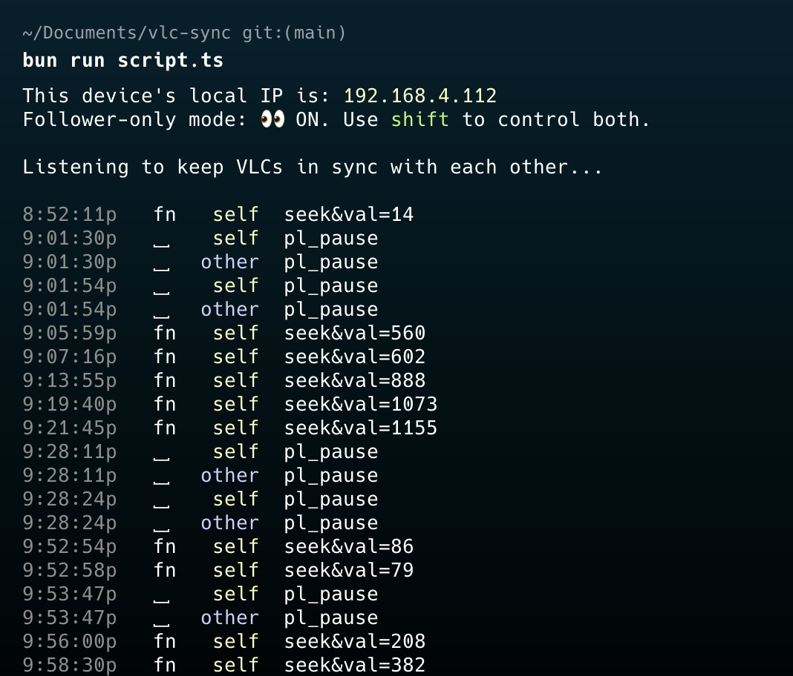

# vlc-sync 🎬

Keep two VLC players in sync during pause, seek forward/back etc.

## Supported Commands

|     |               |                                                                |
| --- | ------------- | -------------------------------------------------------------- |
| ␣   | `spacebar`    | pause both                                                     |
| ←   | `left arrow`  | jump back 10 sec                                               |
| →   | `right arrow` | jump fwd 10 sec                                                |
| fn  | `fn key`      | sync your local video's playtime to match the other computer's |
| \`  | `backtick`    | push your local video's playtime to the other computer         |

## Setup Instructions ⚙️

1. Git clone this repo down to both computers.
2. Duplicate the `.env.local.TEMPLATE` file into `.env.local` (dropping `.TEMPLATE`).
3. Turn on [VLC HTTP Interface](https://wiki.videolan.org/VLC_HTTP_requests/), set the password (see Step 2 below), and update `VLC_PASSWORD` in your `.env.local`. Probably need to restart VLC after turning the HTTP interface on for the first time.
4. Make sure you have [`bun`](https://bun.sh) installed to run the script.
5. Install the js dependencies with `bun install`.
6. Get the other device's local IP address — own device's IP prints to the console whenever the script starts — then set it to `OTHER_IP` in `.env.local`.
7. Start the script with `bun run script.ts`.

_Another way to get device's local IP on Macs:_ Wifi button in Mac menu bar -> "Wifi Settings" -> Details, scroll to bottom.

## How this Works

This is a node script to listen for keyboard events and send commands to VLC on both laptops.

VLC Media Player includes a feature called VLC HTTP interface, which can be used to control VLC remotely. This interface allows you to send commands to VLC via HTTP requests, making it possible to play, pause, seek, and perform other actions from a remote application or script.

Here's a high-level overview of this synchronization solution:

### Step 1: Enable the HTTP Interface in VLC

First, ensure that the HTTP interface is enabled on both instances of VLC.

1. Open VLC.
2. Go to **Tools > Preferences** (or **VLC > Preferences** on Mac).
3. Show settings: **All**.
4. Under **Interface**, select **Main interfaces** and ensure that the **Web** checkbox is checked.
5. Expand the **Main interfaces** option and select **Lua**.
6. Set the **Lua HTTP**. Password to something you'll remember (this is required for remote control).

### Step 2: Determine the IP Address of Both Laptops

Find out the IP addresses of both computers on your local network. This is needed to send commands to VLC from one device to another.

### Step 3: Run the script.ts file.

This script listens for spacebar, left arrow, and right arrow key presses to control play/pause and seek operations on VLC. It sends the commands to both VLC instances running on the specified IP addresses.

### Notes:

- Make sure you replace `'your_vlc_password'` with the actual password you've set for the VLC HTTP interface.
- Update the OTHER_IP address to match the other device.
- This script uses global key hooks, which means it will respond to these keys regardless of which application is currently focused. Be mindful of this when running the script.
- Ensure VLC is configured correctly on both laptops to accept commands via its HTTP interface, as described in the previous VLC setup steps.

This script offers a flexible and efficient way to synchronize video playback controls across multiple devices, utilizing familiar keyboard shortcuts.
